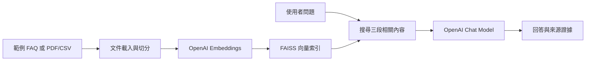

# 校園圖書館智能客服

以 **RAG（檢索增強生成）** 製作的文件問答專題展示版。使用者可載入虛構的圖書館 FAQ 範例，或上傳自己的 PDF／CSV，系統會找出相關內容後再產生回答。

> 範例圖書館 FAQ 是虛構展示資料，不代表任何學校或圖書館的正式規定。

## 功能

- 繁體中文／英文介面切換
- 範例圖書館 FAQ 與自訂 PDF／CSV 上傳
- FAISS 語意檢索與 OpenAI 回答生成
- 最近 3 組問答的有限對話脈絡
- 清除對話、Markdown 對話下載、Session Token 統計
- API 金鑰、額度與連線錯誤提示

## 架構



## 安裝與啟動

```powershell
python -m pip install -r requirements.txt
Copy-Item .env.example .env
notepad .env
streamlit run app.py
```

在 `.env` 填入：

```env
OPENAI_API_KEY=your_openai_api_key
OPENAI_CHAT_MODEL=gpt-4o-mini
OPENAI_EMBEDDING_MODEL=text-embedding-3-small
```

請勿將 `.env` 或任何 API key 提交到 Git。`.gitignore` 已排除 `.env`。

## 建議展示流程

1. 啟動應用程式後選擇「載入範例圖書館 FAQ」。
2. 問「圖書館平日的開放時間是什麼？」。
3. 追問「那週末呢？」以展示有限對話脈絡。
4. 切換為上傳模式，示範系統可套用到不同 PDF 或 CSV。
5. 下載 Markdown 對話紀錄，展示可保存問答結果。

## 履歷描述範例

> 使用 Python、Streamlit、LangChain、FAISS 與 OpenAI API 開發雙語 RAG 文件問答系統；支援 PDF／CSV 知識文件、語意檢索、來源引用與對話紀錄匯出。

## 已知限制

- 每次切換文件會重新建立索引，適合專題展示而非大量文件服務。
- 對話脈絡只保留本次操作最近 3 組問答，不會長期保存。
- 回答品質取決於文件文字品質與 API 模型；系統不應取代正式人工客服。
