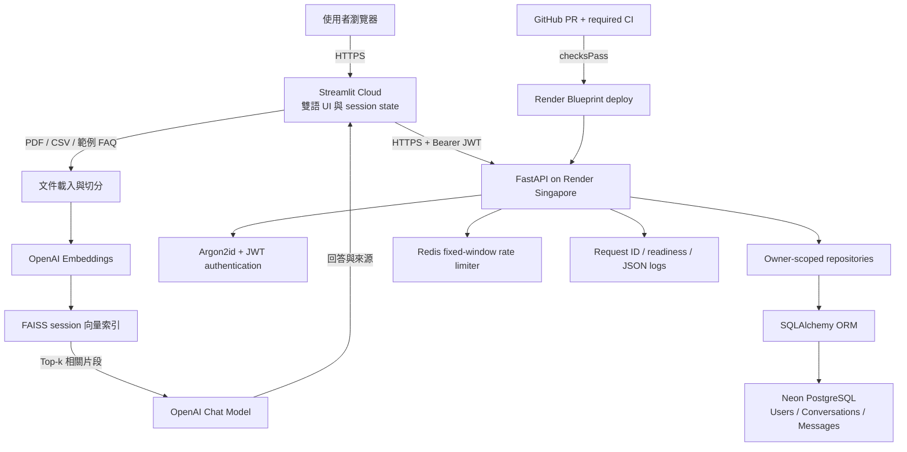

# Campus Library RAG Chatbot｜校園圖書館智能客服

一套可公開展示的雙語文件型 RAG 智能客服。前端使用 Streamlit，支援 PDF／CSV 與範例 FAQ；後端使用 FastAPI、PostgreSQL、JWT 與 Redis，提供身分驗證、個人對話持久化、擁有者資料隔離、分散式限流及基本可觀測性。

> 範例 FAQ 是虛構展示資料，不代表任何學校或圖書館的正式規定。請勿上傳機密或個人敏感文件。

## 線上資源

- Backend API：<https://campus-library-chatbot-api.onrender.com>
- Swagger UI：<https://campus-library-chatbot-api.onrender.com/docs>
- Readiness：<https://campus-library-chatbot-api.onrender.com/ready>
- API 操作說明：[docs/API.md](docs/API.md)
- 五分鐘 Demo 腳本：[docs/DEMO.md](docs/DEMO.md)
- Metrics 與告警操作：[docs/OPERATIONS.md](docs/OPERATIONS.md)
- 資料庫復原演練與 runbook：[docs/RECOVERY.md](docs/RECOVERY.md)
- 面試知識整理：[INTERVIEW_GUIDE.md](INTERVIEW_GUIDE.md)

Render Free instance 閒置後會休眠，第一次請求可能需要等待約 50 秒或更久。

## 核心功能

- 繁體中文／英文 Streamlit 介面
- Email 註冊、Argon2id 密碼雜湊、JWT 登入與登出
- 範例圖書館 FAQ，以及自訂 PDF／CSV 文件載入
- OpenAI Embeddings、FAISS 語意檢索與具來源脈絡的回答
- 個人 Conversation／Message 建立、切換、改名、刪除與重新登入還原
- Owner-scoped repository 查詢，阻止跨帳號讀取或修改資料
- Neon PostgreSQL、SQLAlchemy ORM 與 Alembic migration
- Redis 原子固定視窗限流、429／`Retry-After` 與 rate-limit headers
- `/health`、`/ready`、`X-Request-ID` 與 JSON request logs
- Prometheus request counter、latency histogram 與 in-flight gauge
- GitHub Actions required checks、Render Blueprint 與自動部署

## 系統架構



### 一次問答的資料流

1. Streamlit 驗證 server-side session 中的 JWT，並載入登入者的個人對話。
2. 使用者問題先經 FastAPI 保存為 owner-scoped user message。
3. 前端從 FAISS 取回相關文件片段，連同最近六則訊息送往模型。
4. 回答顯示來源後，再透過專用 endpoint 保存為 assistant message。
5. 使用者重新登入時，後端依 JWT subject 只回傳該帳號擁有的對話與訊息。

## 技術選型

| 層級 | 技術 | 選擇理由 |
| --- | --- | --- |
| UI | Streamlit | 快速完成可互動、可部署的資料與 AI 專題介面 |
| RAG | LangChain、FAISS、OpenAI | 將文件切分、embedding、相似度檢索與回答生成串成清楚流程 |
| API | FastAPI、Pydantic | 型別化 request／response、dependency injection 與自動 OpenAPI |
| 資料層 | SQLAlchemy、Alembic | 分離 ORM／repository，並以可回溯 migration 管理 schema |
| Database | Neon PostgreSQL | 託管 PostgreSQL，正式與開發資料可使用不同 branch |
| Security | Argon2id、JWT | 不保存明文密碼；以短期 Bearer token 驗證 API request |
| Rate limit | Redis + Lua | 跨 process 共用計數，並以單一原子操作完成 INCR／TTL |
| Delivery | GitHub Actions、Render | required CI 保護 main，通過後才自動部署 production |

## Repository 結構

```text
.
├─ app.py                         # Streamlit UI 與 RAG 流程
├─ frontend_api.py                # 前端對 FastAPI 的 HTTP 邊界
├─ frontend_auth.py               # JWT 與登入 session lifecycle
├─ frontend_conversations.py      # 個人對話狀態與持久化協調
├─ backend/
│  ├─ main.py                     # FastAPI app、health、readiness
│  ├─ auth.py                     # register／login／me endpoints
│  ├─ conversations.py            # Conversation／Message endpoints
│  ├─ dependencies.py             # DB session、settings、current user
│  ├─ models.py                   # SQLAlchemy ORM models
│  ├─ repositories.py             # owner-scoped database operations
│  ├─ schemas.py                  # Pydantic validation contracts
│  ├─ security.py                 # Argon2id 與 JWT
│  ├─ rate_limit.py               # Redis Lua fixed-window limiter
│  ├─ observability.py            # request ID、429 headers、JSON logs
│  └─ alembic/                    # Database migrations
├─ tests/                         # 前端單元測試
├─ backend/tests/                 # 後端單元與 API integration tests
├─ render.yaml                    # Render Blueprint
└─ .github/workflows/ci.yml       # 前後端 CI
```

## 本機開發

需求：Python 3.11、可使用的 OpenAI API key；若要啟用完整後端，還需要 PostgreSQL。Redis 在本機預設關閉。

### 1. 建立兩個隔離環境

```powershell
py -3.11 -m venv .venv
py -3.11 -m venv .venv-backend
.
\.venv\Scripts\python.exe -m pip install -r requirements-dev.txt
.\.venv-backend\Scripts\python.exe -m pip install -r backend/requirements-dev.txt
```

前端仍使用 Pydantic 1，後端使用 Pydantic 2；分開環境可以避免相依版本衝突。

### 2. 設定環境變數

```powershell
Copy-Item .env.example .env
notepad .env
```

至少設定：

```env
OPENAI_API_KEY=your_openai_api_key
BACKEND_API_URL=http://localhost:8000
DATABASE_URL=postgresql+psycopg://...
DIRECT_DATABASE_URL=postgresql+psycopg://...
JWT_SECRET_KEY=replace_with_at_least_32_random_bytes
RATE_LIMIT_ENABLED=false
```

`.env` 已被 `.gitignore` 排除；禁止提交 API key、JWT secret 或資料庫 URL。

### 3. Migration 與啟動

```powershell
.\.venv-backend\Scripts\python.exe -m alembic -c backend/alembic.ini upgrade head
.\.venv-backend\Scripts\python.exe -m uvicorn backend.main:app --reload --port 8000
```

另開一個終端：

```powershell
.\.venv\Scripts\python.exe -m streamlit run app.py
```

## 測試與品質檢查

```powershell
# 前端與 RAG evaluation helpers：54 tests
.\.venv\Scripts\python.exe -m pytest tests -q

# 後端：119 tests
.\.venv-backend\Scripts\python.exe -m pytest backend/tests -q

.\.venv\Scripts\python.exe -m pip check
.\.venv-backend\Scripts\python.exe -m pip check
git diff --check
```

測試使用 mocks 與隔離 SQLite，不連 production Neon，也不呼叫真實 OpenAI API。現有一項來自 FastAPI／Starlette TestClient 的棄用警告，不影響測試結果。

真實模型的作品集評估另以 16 個中英文案例執行，涵蓋可回答問題與
out-of-scope fallback；目前 Top-3 retrieval hit rate 為 100%，grounded
answer pass rate 為 94%。完整方法、逐案結果與限制見
[`docs/RAG_EVALUATION.md`](docs/RAG_EVALUATION.md)。

## 安全與可靠性設計

- 明文密碼只在 request 記憶體短暫存在，資料庫只保存 Argon2id hash。
- JWT secret 由環境變數管理；JWT `sub` 保存使用者 UUID。
- Email 不存在時仍執行 dummy Argon2 verify，降低帳號枚舉時間差。
- Conversation owner 只取自驗證後的 current user，不接受 client 傳入 `user_id`。
- 不存在與無權存取的 conversation 都回同樣 404，減少資源枚舉線索。
- Redis key 使用雜湊後識別值；JSON logs 不記錄 token、body、query string 或原始 IP。
- Redis 異常時 request path fail-open，但 `/ready` 回 503，兼顧可用性與監控可見性。
- 使用者上傳的 PDF／CSV 只存在 Streamlit session，不永久寫入後端資料庫。

## 已知限制與下一步

- RAG 仍在 Streamlit process 執行，適合作品展示；正式多使用者系統應移至後端 job／worker。
- FAISS 索引是 session-local，每次更換文件會重建，尚未使用持久化向量資料庫。
- JWT 只有 access token，尚未實作 refresh token、Email 驗證、忘記密碼或 OAuth。
- Render Free instance 會休眠；正式服務應改用常駐 instance 與獨立 migration job。
- 目前 Redis 固定視窗在視窗交界可能容許突發流量；更嚴格需求可改 sliding window 或 token bucket。
- 後續可加入備份還原演練、Sentry／OpenTelemetry 與真正的後端 RAG pipeline。

## 履歷描述範例

> 開發並部署雙語 RAG 文件客服，使用 Streamlit、LangChain、FAISS 與 OpenAI 完成 PDF／CSV 語意檢索；以 16 個雙語案例驗證 Top-3 retrieval 100% 與 grounded answer 94%；並以 FastAPI、SQLAlchemy、Alembic、Neon PostgreSQL 實作 Argon2id／JWT 身分驗證、owner-scoped 對話持久化及 Redis Lua 分散式限流，搭配 173 項自動測試與 GitHub Actions／Render 自動部署。

## License

本專案目前未宣告開源授權；程式碼僅供作品集檢視。若要重用或散布，請先聯絡 repository owner。
